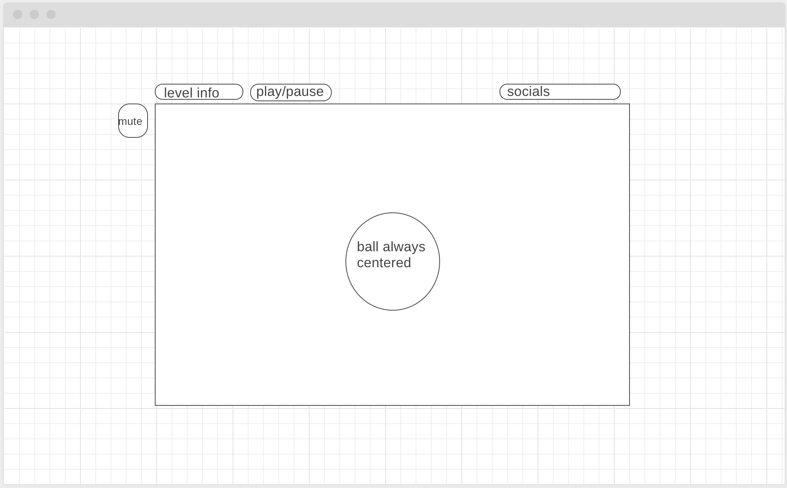

## Just Roll - A Javascript based 3D Physics Game
### Background and Overview
Just Roll is a real-time physics simulation (game?) that allows the user to live out there dreams of being an indestructable ball
that rolls through an obstacle course. Just Roll allows the user to tilt the course in real time in order to get the ball
to their destination. Just try not to fall off the level.

Just Roll uses collision detection to prevent the sphere from passing the course and landmarks for helping the user gauge
distance in the virtual 3D environment.

### Functionality and MVP
In Just Roll users will have to navigate
* A flat environment with no hazards (we'll go easy on them at first)
* environments with obstacles pushing the ball away
* uneven ground surfaces
* taking advantage of the ball's elasticity to bounce over hazards

### Wireframe
The app will have the HTML canvas in the center with menu controls such as play/pause and menu select at the top left.
Social media links will be at the top right for interested persons. Mute button will appear left of the canvas

### Architecture and Technologies
This App will use the the following technologies
* Vanilla Javascript for DOM physics logic
* 3.js for 3D rendering
* Web Audio API for sound generation
* Webpack to bundle the files

### Implementation Timeline
**Day 1**
 - Get webpack and package.json running
 - Learn 3.js well enough to render basic shape and skybox
 
 **Day 2**
 - have ball on a flat surface working
 
 **Day 3**
 - attempt collisions and elastic properties of objects
 
 **Day 4**
 flesh out interface
 - play/pause
 - mute
 - social media links
 
 **Bonus**
 Get jump and bounce working
